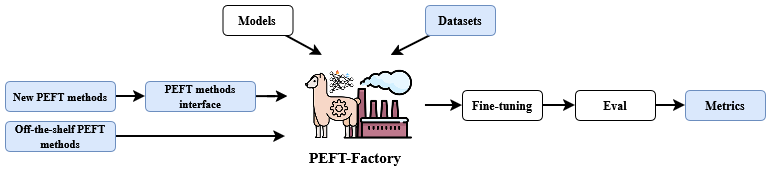

<div align="center" markdown="1">

----

### Unified Benchmark for PEFT methods
This repository contains all files necessary to run PEFT-Bench and to replicate our paper: 

[**PEFT-Bench: A Parameter-Efficient Fine-Tuning Methods Benchmark**](https://arxiv.org/pdf/2511.21285v2)

</div>


## Installation and Setup

First you will need to clone this repository. And change the directory into it.

```bash
git clone https://github.com/kinit-sk/PEFT-Bench.git

cd PEFT-Bench
```

After that you need to install the peftfactory framework which runs all of the training.

### Wandb logging
You can also install wandb. This will automatically create a wandb project for each method called `peft-factory-multiple-{peft-method}`.

```bash
pip install peftfactory
```

## Run full benchmark

This will run the ./scripts/run_exp.py, which will run sequential training and evaluation on 27 datasets, 7 PEFT methods, 5 seeds and 1 model. 

**⚠️ ⚠️ This will run 945 training and 945 evaluations ⚠️⚠️**

```bash
./run_full_benchmark.py
```

## Run full benchmark with slurm

First you need to setup your slurm settings in `scripts/peftbench/slurm/run_train_eval.sh`. This scripts runs single training and eval (this script will be later called using sbatch).

```bash
vim scripts/peftbench/slurm/run_train_eval.sh
```

Now simply run the script. 

**⚠️⚠️ This will Create 945 slurm jobs ⚠️⚠️**

```bash
./run_full_benchmark_slurm.sh
```

## Citation
```bibtex
@article{belanec2025peft,
  title={PEFT-Bench: A Parameter-Efficient Fine-Tuning Methods Benchmark},
  author={Belanec, Robert and Pecher, Branislav and Srba, Ivan and Bielikova, Maria},
  journal={arXiv preprint arXiv:2511.21285},
  year={2025}
}
```